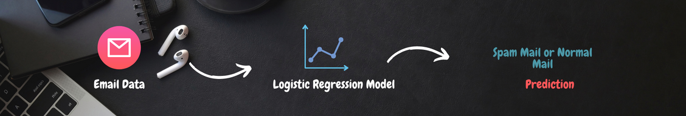

# Identify-Spam-Email-ML-Model

This Project Identify the spam email from the CSV file that is attatched to it. This code is build with Python Language with Machine Learning Libraries.

# Goal
- #### Identify Which email is spam mail or which email is regular email.

# WorkFlow


## Explain
- First of all we need a data spam mail as well as Normal Email (ham mail). We will use this data to train our model. But we don't do it directly.
- we need to process this data and second will be the data pre-processing. As we might know as It is easier for machine to understand the numbers and Tough
to understand the text or paragraghs et.c So we need to convert out text data into more meaningful numbers that will done in the data preprocessing.
- After that we split our data into training data and testing data. As we know the training data we use to Train the model and the test data is used for the
prediction or evaluate the model.


- So Once we split our Original data into training data and testing data. We will feed to a Logistic regression model. SO the training data used to train the logistic regression
model. So in this case we use a logistic regression model are the best when it comes to binary classification problem.



- Once we have done this then we have a Trained Logistic regression model. Now then we give a new mail to Logistic regression which is trained one. It will predict weather
mail is a Spam mail or a normal mail.

# Code

## Let me teach you. How I Created this Project and What I have learned from it.

### Firstly I Import Python Libraries that will help me to acheive this.

```python
import numpy as np
import pandas as pd
from sklearn.model_selection import train_test_split
from sklearn.feature_extraction.text import TfidfVectorizer
from sklearn.linear_model import LogisticRegression
from sklearn.metrics import accuracy_score
```
### Let me Describe One by one about the libraries
```python
import numpy as np
```
Numpy is a library that is used to create numpy arrays. Most of the cases we need arrays for we imported into.

```python
import pandas as pd
```
Pandas Library is used to create DataFrams. It is helpful to analyze the CSV file (Comma-Seperated-Values). It will provide us a more structured table.

```python
from sklearn.model_selection import train_test_split
```
Sklearn is also important library that is used in data science and machine learning applications. As we told you we need to split our data into training and test data.
for that we need this train_test_split function.

```python
from sklearn.feature_extraction.text import TfidfVectorizer
```
The Purpose of this TfidfVectorizer is. We need to Convert mail Text data in to numerical value to better understanding of machine to analyze. When you feed the text data
machine learning model cannot understant it.

```python
from sklearn.linear_model import LogisticRegression
```
We use Logistic regression model to classify the Spam mail or normal mail (Ham Mail)

```python
from sklearn.metrics import accuracy_score
```
As we told you we split data into training and testing data and that training data is used in order to train our logistic regression model. Once we do that we will used
the test data in order to evaluate the model and that's why we need to import this accuracy_store library. So this function will use to evaluate how well our model is 
performing and how many good prediction is making.
